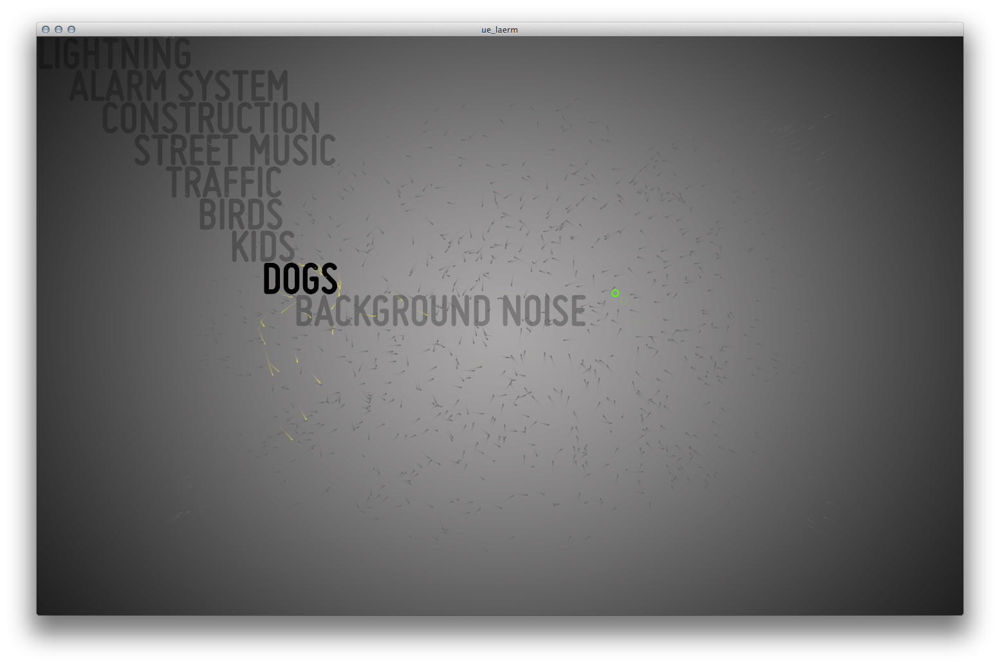

Urbane Ebenen Lärm
==================

(EN: Urban Layers Noise)  

  

Multitouch project by the-moron.net represented by Fabian Morón Zirfas (@fabiantheblind) and Peter Sekan (@PDXIII) students at the University of Applied Sciences Potsdam (FHP) during the class by Till Nagel ( @tillnagel ) "Urbane Ebenen" (urban layers) in 2010.   

At the time we wrote this we found it usefull to develop in Eclipse. For portability reasons I ported it from [proclipsing](https://code.google.com/p/proclipsing/) back to Processing 2.x. 
See the original 2010 google code svn page [here](https://code.google.com/p/tmn-ue-learm/).  

Also I made a license change.  

Copyright (c)  2013 Peter "PDXIII" Sekan & Fabian "fabiantheblind" Morón Zirfas  
Permission is hereby granted, free of charge, to any person obtaining a copy of this software and associated documentation files (the "Software"), to deal in the Software  without restriction, including without limitation the rights to use, copy, modify, merge, publish, distribute, sublicense, and/or sell copies of the Software, and to  permit persons to whom the Software is furnished to do so, subject to the following conditions:  
The above copyright notice and this permission notice shall be included in all copies or substantial portions of the Software.  
THE SOFTWARE IS PROVIDED "AS IS", WITHOUT WARRANTY OF ANY KIND, EXPRESS OR IMPLIED, INCLUDING BUT NOT LIMITED TO THE WARRANTIES OF MERCHANTABILITY, FITNESS FOR A  PARTICULAR PURPOSE AND NONINFRINGEMENT. IN NO EVENT SHALL THE AUTHORS OR COPYRIGHT HOLDERS BE LIABLE FOR ANY CLAIM, DAMAGES OR OTHER LIABILITY, WHETHER IN AN ACTION OF  CONTRACT, TORT OR OTHERWISE, ARISING FROM, OUT OF OR IN CONNECTION WITH THE SOFTWARE OR THE USE OR OTHER DEALINGS IN THE SOFTWARE.  

see also http://www.opensource.org/licenses/mit-license.php

